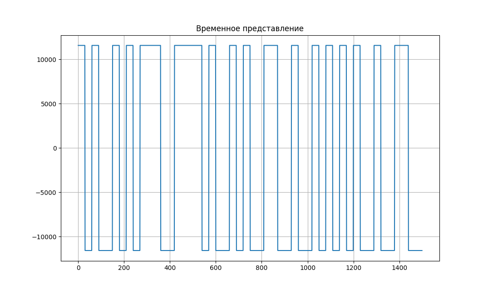
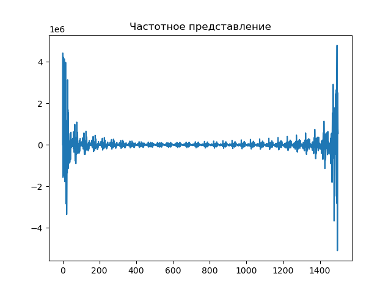
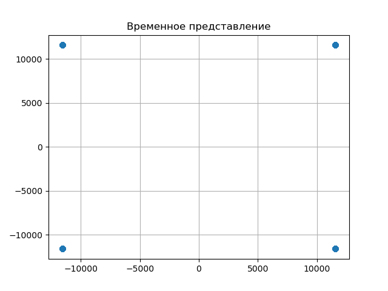
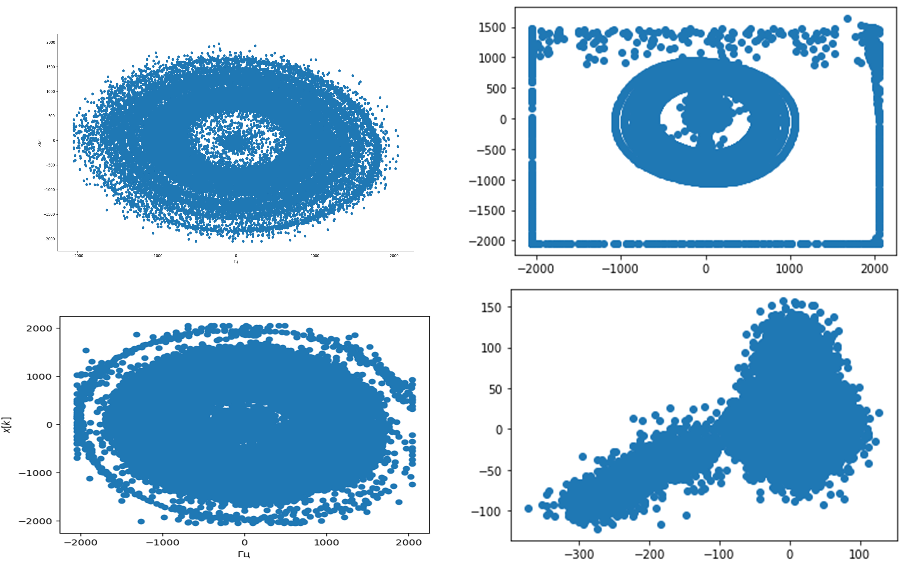
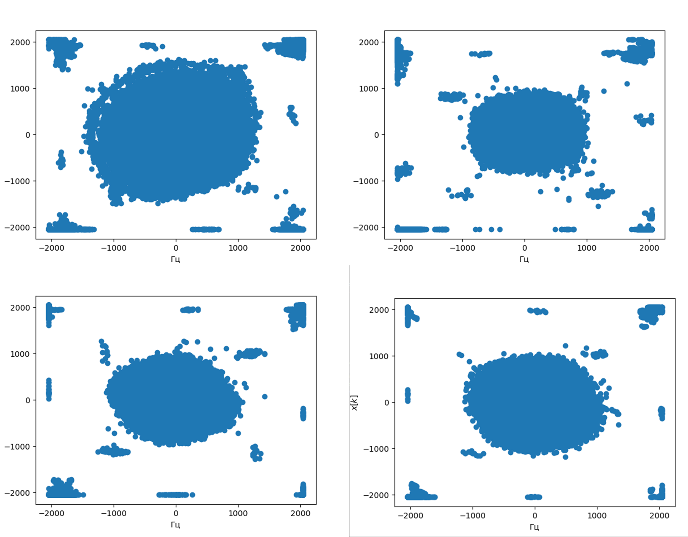
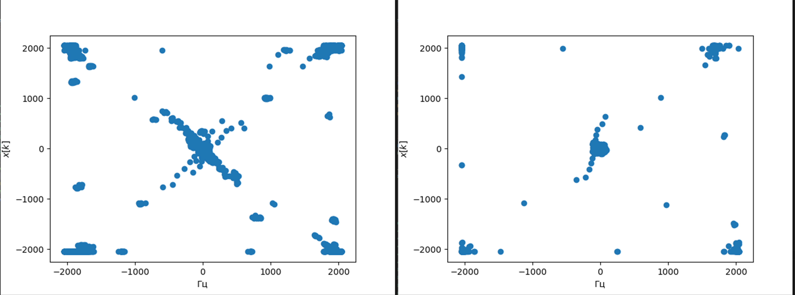
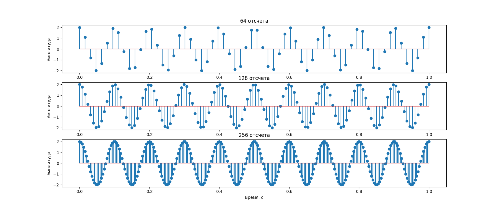
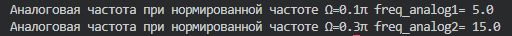
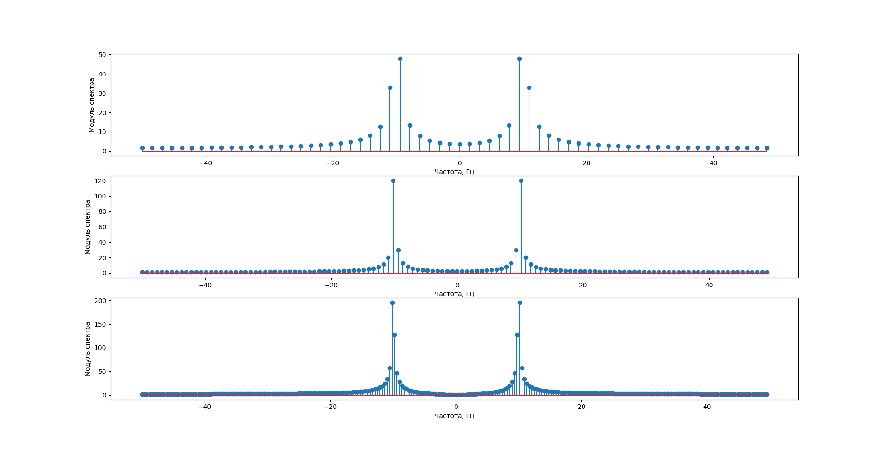

# Exams

## Задание №1

Входные параметры:
N – число бит, четное значение (например, 50)
Fs – частота дискретизации (например, 500 000 семплов в сек)
Ns – число семплов на 1 модуляционный символ (например, 10/30/50/100 семплов на символ)
Несущая частота – 900 МГц

Передатчик:
1.	Сформируйте случайную битовую последовательность из N бит (вх.параметр)
2.	Добавьте 20 бит с единицами, выполняющих роль синхронизирующей последовательности, а также опорных пилотных сигналов, по которым можно будет оценить изменение фазы полученного сигнала
3.	Сформируйте массив комплексных QPSK-символов. Длительность одного символа равна Ns отсчетов
4.	Зациклите буфер с символами на передачу и отправьте в радиоэфир
5.	Выведите на график временное и частотное представление сформированного сигнала

Приемник:
1.	Запишите входной сигнал в массив 
2.	Выведите на график временное и частотное представление сформированного сигнала. Проанализируйте влияние длительности передаваемого символа на ширину спектра, изменяя параметр Ns (уменьшить и увеличить, вывести график трех спектров: для Ns, Ns/2 и Ns*2)
3.	Определите время начала последовательности с учетом ваших знаний о синхронизирующей последовательности.
4.	Выведите на комплексной плоскости координаты полученных значений (перекрученные созвездия)
5.	Проанализируйте изменение фазы сигналов, используя символы синхронизирующей последовательности и компенсируйте данное изменение для информационных символов (разверните созвездия на верные позиции для последующей демодуляции)
6.	Выполните демодуляцию полученных символов, сравните переданную и полученную битовые последовательности, определите количество ошибок.


## Реализация

1. Сформировали массив длинной 50 из рандомных значений от 0 до 3 и закодировали каждый символ 2 битами

```py
x_int = np.random.randint(0, 4, num_symbols) 
bit = ''
for i in range(len(x_int)):
        if x_int[i]==0:
            bit+='00'
        if x_int[i]==1:
            bit+='01'
        if x_int[i]==2:
            bit+='10' 
        if x_int[i]==3:
            bit+='11'
```
далее мы все равно отправляем не эти биты а просто набор символов переведенные в фазу и далее в комплексные числа (Не успел реализовать)

2. Превращаем значения в комплексные числа
```py
x_symbols = np.cos(x_radians) + 1j*np.sin(x_radians) 
samples = np.repeat(x_symbols, Ns) # на каждый символ уходит Ns samples 
samples *= 2**14                   #увеличиваем амплитуду 
```
- Наши данные: 

*Во временном представлении:*



*В частотном представлении:*




- Наши данные в разделении на реальную и мнимую этот вид и подаем на передатчик:



3. Организовываем передатчик

```py
def Txer(data): # Отправка данных
    while 1:       #зациклил while т.к. sdr.tx_cyclic_buffer быстро завершал отправку
        sdr.tx(data)
        sdr.tx_destroy_buffer()
        print(1)
```
4. Организовываем приемник
```py
def listen_efir(data):   # Прием данных в реальном времени
   
    for r in range(50):
        sdr.tx(data)
        sdr.tx_destroy_buffer()
        rx_data = sdr.rx()
        plt.clf()
        plt.scatter(rx_data.real,rx_data.imag)
        plt.draw()
        plt.xlabel('Гц')
        plt.ylabel('$x[k]$')
        plt.pause(0.05)
        time.sleep(0.1)
```        

- Неудачные попытки приема 



- Еще немного




Тут более похоже на QPSK сигнал

- Самые мало-зашумленные сигналы принимались и предавались на одной SDR



5. Декодировать сигнал неуспел

## Задание №2

Дискретизация сигналов. Вычисление ДПФ 
Аналоговый сигнал x(t)=Acos(ωt) при дискретизации с интервалом времени T_s преобразуется в последовательность дискретных значений (чисел)  x(n)=Acos(ωnT_s )=Acos(Ωn)

1.Задайте  сигнал с частотой f, Гц, выберите частоту дискретизации  fs отсч/сек.  Получите набор отсчетов сигнала размером 64, 128, 256, изобразите выборку отсчетов командой plt.stem

2.Определите значение аналоговой частоты сигнала, которая соответствует нормированной частоте Ω=0.1π рад, Ω=0.3π при fs первого раздела   

3.При помощи функции fft модуля numpy вычислите ДПФ сигнала из раздела 1 для трех наборов отсчетов. Изобразите модуль спектра ДПФ с указанием частотной оси в Гц. 
Основы цифровой фильтрации

Сформируй	те сигнал, состоящий из суммы двух гармонических колебаний (косинусов) разных частот. Выберите частоту дискретизации для данного сигнала. Изобразите спектр ДПФ полученных отсчетов. 
Рассчитайте отсчеты цифрового фильтра ФНЧ с частотой среза для подавления сигнала с большей частотой. Импульсная характеристика ФНЧ вычисляется по  выражению h(n)=  (sin⁡(Ω_c n))/πn  Ω_c  – нормированная частота среза.
Примените полученную импульсную характеристику фильтра к входному сигналу.
Изобразите спектр ДПФ сигнала после фильтрации

## Реализация

1.  Генерируем сигнал с такими характеристиками

```py
A = 2     
f = 10      
fs = 100    
T = 1/fs  
x = A * np.cos(2 * np.pi * frequency * t)
```
Меняем только количество отсчетов: 



2.


3. Вычисление ДПФ для трех сигналов




