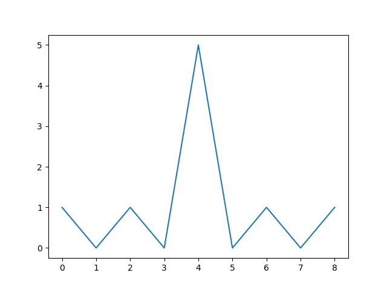
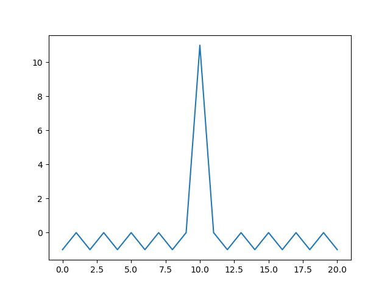
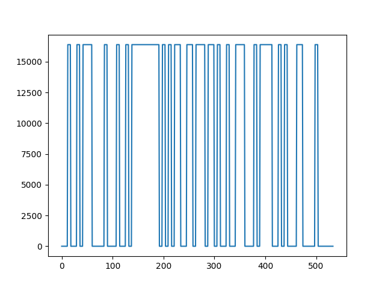
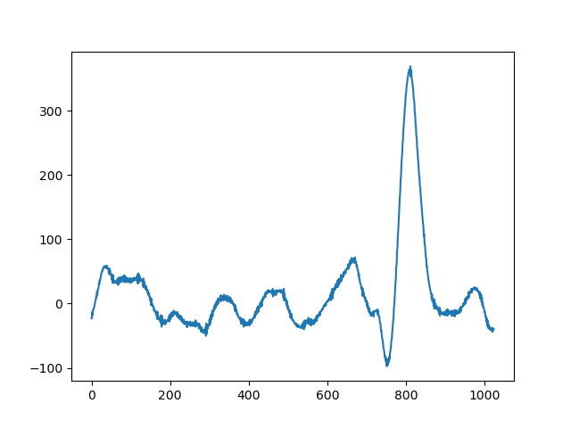

# Lesson 10


1. Определяли корреляцию для кода Баркера

- Длина 5

```py
a = np.array([1, 1, 1, -1, 1])
b = np.correlate(a,a,'full')
```



- Длина 11

```py
a = np.array([1, 1, 1, -1, -1, -1, 1, -1, -1, 1, -1])
b = np.correlate(a,a,'full')
```



2. Сформированный модулированный сигнал





3. Принятый сигнал ASK




- Принятые данные записали в файл для дальнейшей обработки


```py
np.savetxt (" my_data.csv", rx_data, delimiter=" , ")
```