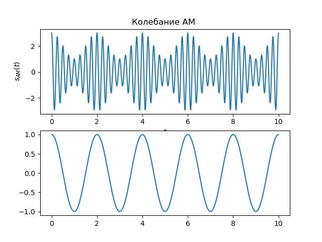
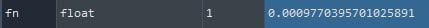

# Lesson_5

## Задание на работу

Задание на работу
1. Для заданных значений параметров несущего колебания и НЧ сигнала
определите значение частоты дискретизации (в менеджере переменных),
значение индекса АМ. Получите временную и спектральную диаграммы
несущего колебания и НЧ сигнала.

2. Получите сигнал АМ с параметрами fc = 4, fm = 0.2, Ac = 2 , Am = 0.5.
Получите временную и спектральную диаграммы несущего колебания и
НЧ сигнала. Определите нормированную частоту среза ФНЧ fn в менеджере переменных. Попробуйте изменить ее значение (задайте в программе fn) и сравните качество дететирования.

Cигнал АМ с параметрами `fc = 4, fm = 0.2, Ac = 2 , Am = 0.5`

*Изменил нормированную частоту среза на `0.1`*

3. Получите сигнал АМ с параметрами fc = 2, fm = 0.2, Ac = 2 , Am = 1.5.
Получите временную и спектральную диаграммы несущего колебания и
НЧ сигнала. Определите нормированную частоту среза ФНЧ fn в менеджере переменных. Попробуйте изменить ее значение (задайте в программе fn) и сравните качество дететирования.

Cигнал АМ с параметрами `fc = 2, fm = 0.2, Ac = 2 , Am = 1.5`

*Изменил нормированную частоту среза на `0.1`*

