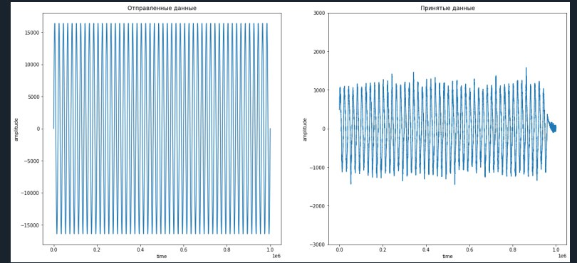
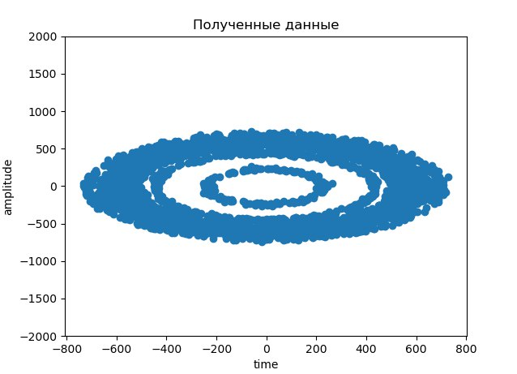
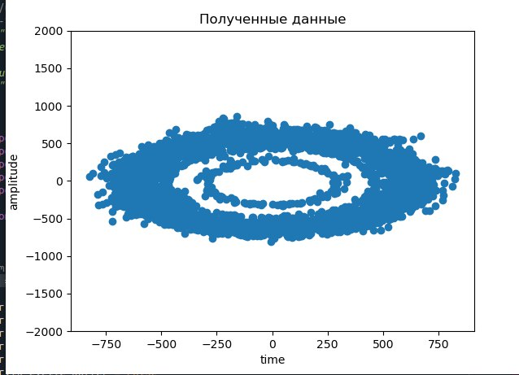

# Lesson 7


### Lecture

<details>
1. Косинус

 


2. Синус


3. Символ КАМ модулированного сигнала 


4. Шум


5. Cимвол КАМ модулированного сигнала с шумом


6. Модуль спектра КАМ модулированного сигнала


7. Модуль спектра символа после умножения на опорный косинус в приемнике


8. Импульсная характеристика цифрового ФНЧ


9. Фильтрация в фнч косинусной части принятого сигнала


10. фильтрация в фнч синусной части принятого сигнала


</details>

### Practic

1. Передайте синусойду в рамках одного ADALM Pluto SDR. 

- Генерируемые вами значения должны быть комплексными, а значит, необходимо формировать две составляющие, реальную и мнимую. Например:

```py
i = np.cos(2 * np.pi * t * fc) * 2 ** 14
q = np.sin(2 * np.pi * t * fc) * 2 ** 14
```

- Подаем на передатчик

```py 
samples = i + 1j * q 
```


2. Спектр полученного сигнала


3. Генерируем QPSK-модулированный сигнал, 16 сэмплов на символ

```py
num_symbols = 1000
x_int = np.random.randint(0, 4, num_symbols) # 0 to 3
x_degrees = x_int*360/4.0 + 135 # 45, 135, 225, 315 град.
x_radians = x_degrees*np.pi/180.0 # sin() и cos() в рад.
x_symbols = np.cos(x_radians) + 1j*np.sin(x_radians) #генерируем комплексные числа
samples = np.repeat(x_symbols, 16) # 16 сэмплов на символ
samples *= 2**14 #Повысим значения для наших сэмплов
```

Приятые данные






