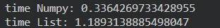
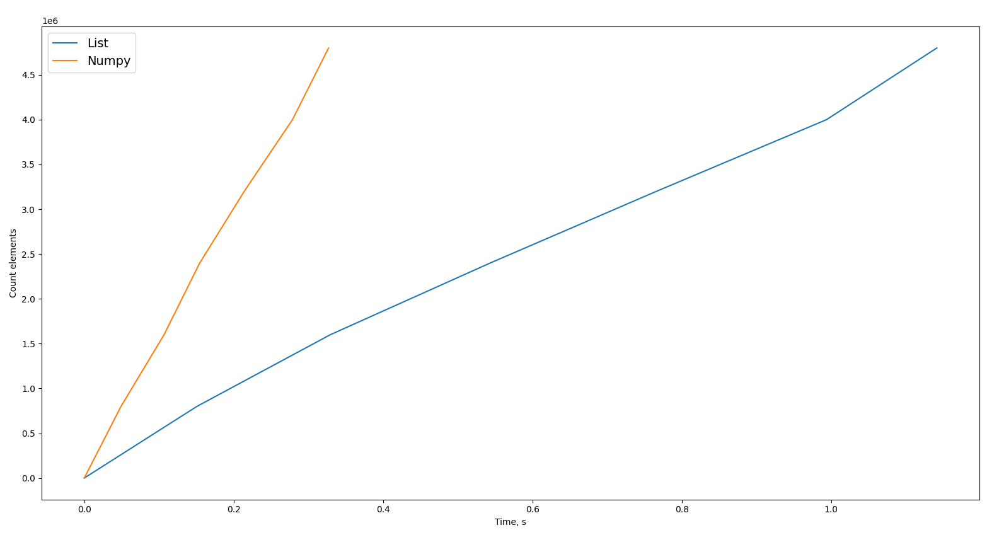
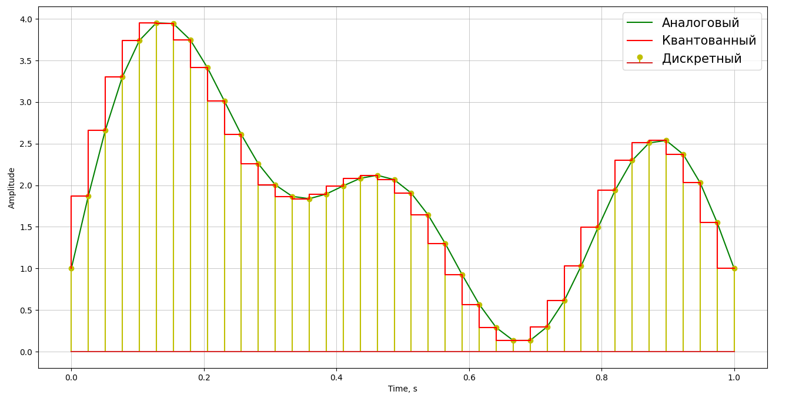

# LESSON_2

## Задание №1 Сравнение скорости работы lists и NumPy

**Время выполнения сортировки массива из 5.000.000 элементов для Lists и NumPy**

**График**

## Задание №2 Создание графиков с различным стилем отображения

