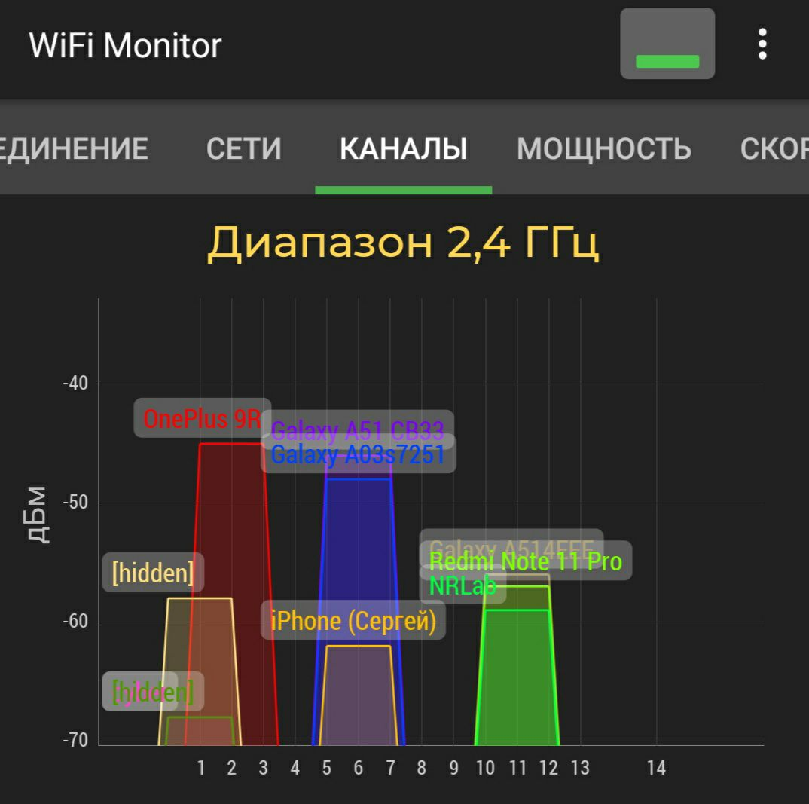
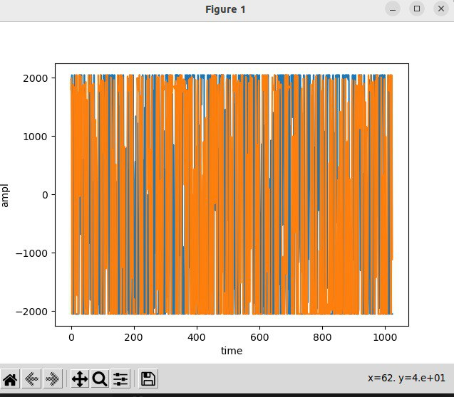
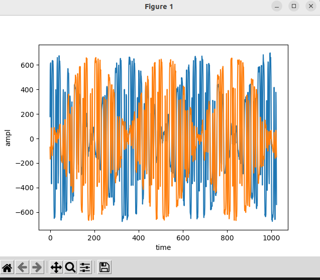
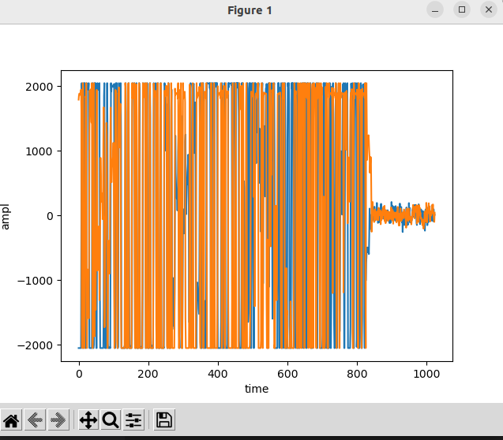
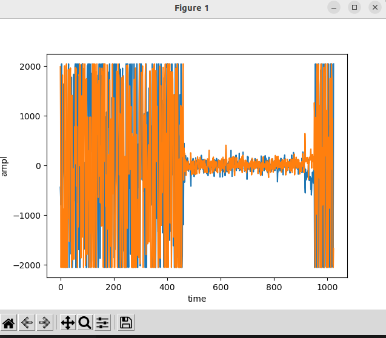

# LESSON_3


1. При помощи приложения на **WifiAnalyzer** нашли канал наиболее мощной точки доступа. Из ___скриншота___ ниже мы видим, что это точка доступа с SSID **OnePlus 9R**



В **WifiAnalyzer** есть информация о ___канале___ и ___несущей частоте___ в этом канале (обычно это центральная частота). У нас ___2-й канал___ и ___частота 2417 МГц___

### 2. Разбирем код

- Библиотеки

```py
import time                     # для измененя частоты смены кадров 
import adi                      # для работы с Adalm-Pluto
import matplotlib.pyplot as plt # для отрисовки графика
import numpy as np              # для выделения реальной и мнимой части
```

- Подключаемся к **SDR**

```py
sdr = adi.Pluto("ip:192.168.2.1") 
```

- Устанавливаем значение ***несущей частоты*** в соответствии с каналом

```py
sdr.rx_lo = 2417000000
```

- Сбор данных и отрисовка графиков

```py
for r in range(30):     #кол-во кадров с графиками
    rx = sdr.rx()       # принятые данные помещаем в rx
    plt.clf()           # на каждой итерации очищение старого графика
    plt.plot(rx.real)   # отрисовываем реальную часть
    plt.plot(rx.imag)   # отрисовываем мнимую часть
    plt.draw()          # пересовываем фигуру
    plt.xlabel('time')
    plt.ylabel('ampl')
    plt.pause(0.05)     # небольшая пауза перед отрисовкой, чтобы успеть обработать данные
    time.sleep(0.1)     # время смены кадра 
    
    # усреднение шума и сигнала p.s. требуется подтверждение преподавателя легально ли?
    for i in range(len(rx.imag)):  
       s+=rx.imag[i]               # сумма мнимых значений
    sred=s/len(rx.imag)            # считаем среднюю 
    if rx.imag[r]>sred:            # сравнимаем среднее значение со всеми мнимыми элементами  
        time.sleep(2)              # получаем задержку где колебания усреднены и не выше средней
    #print(sred)

plt.show()# #выводим график
```

## Результат :

 



 


