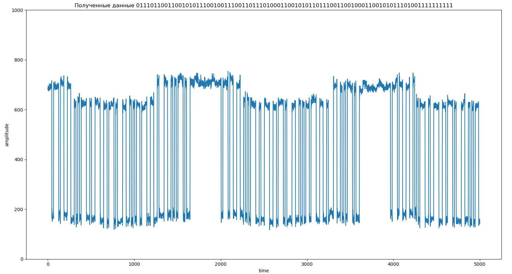

# Lesson8

1. Сформировали сигнал на отправку

2. Для определения где полезная информация добавили с двух сторон по 10 едениц

3. Отправили это `TX`

4. Приняли на другой SDR  

5. 

Принятые -      `01110110011001010111001001110011011101000110010101101110011001000110010101110100`

Отправленные -  `01110110011001010111001001110011011101000110010101101110011001000110010101100100`

Отправленное слово - `verstended`

Принятое рашифрованное слово - `verstendet`

Один бит был не правильно расшифрован