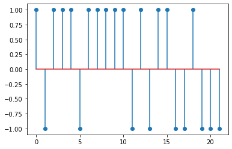
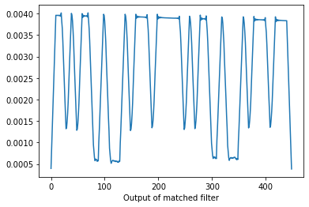
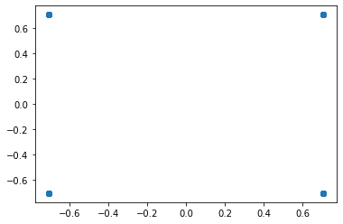
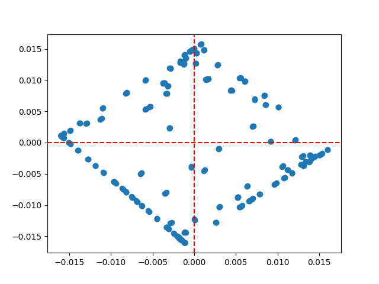
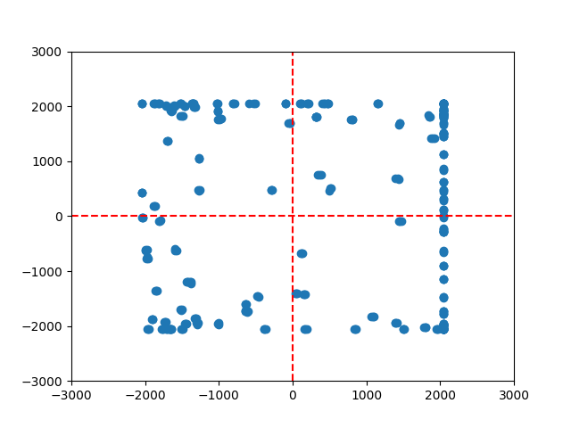

# Lesson 11


## AM модуляция

- Отправленные не преобразованные отчеты:



- Принятый сигнал после свертки:




## QPSK модуляция

- Отправленные qpsk отчеты 




- Принятый QPSK сигнал сразу:




- Принятый QPSK сигнал усреднение и уввеличение амплитуды:

```py
xrec = data_rx/np.mean(data_rx**2)
```



