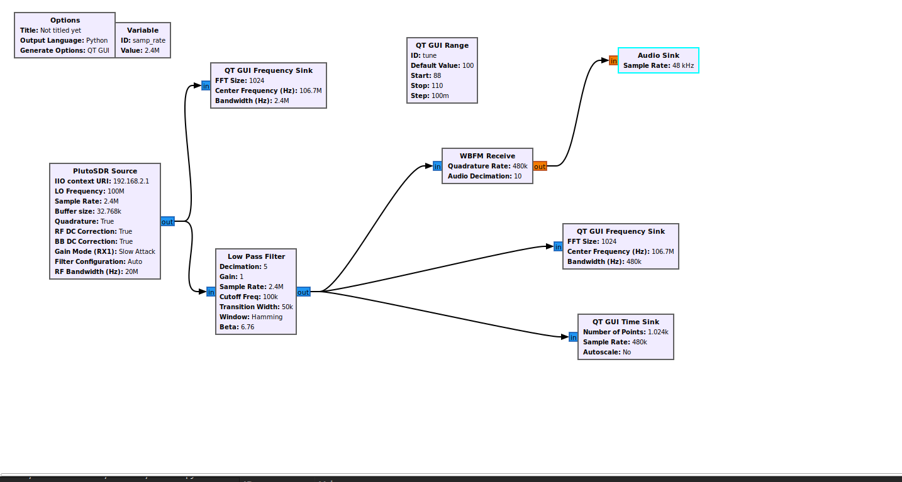

# Lesson 15


1. [Хакнуть SDR](https://humble-ballcap-e09.notion.site/nicoskin/PlutoSDR-6e3f0880417f4927895cffa93ca2cf50) 

`ssh root@192.168.2.1`

Пароль по умолчанию - `analog`

Вы должны увидеть экран приветствия PlutoSDR. Теперь вы подключились по SSH к ARM-процессору на самом Pluto! Если у вас устройство Pluto с версией прошивки 0.31 или ниже, введите следующие команды:

```sh
fw_setenv attr_name compatible

fw_setenv attr_val ad9364

reboot

```

А для версии 0.32 и выше используйте:

```sh
fw_setenv compatible ad9364

reboot
```

Теперь вы можете настраивать частоты от **70 МГц** до **6 ГГц** , не говоря уже о частоте дискретизации до 56 МГц! Ура!

(до этого было от **325** МГц до **3.8** ГГц, из-за того что программно стояла AD9363)

**На случай ошибки:**  

`ssh-keygen -f “/home/plutosdr/.ssh/known_hosts” -R “192.168.2.1”`


2. Построение радио-приёмника в GNU Radio. 

- GUI



- Вывод 

